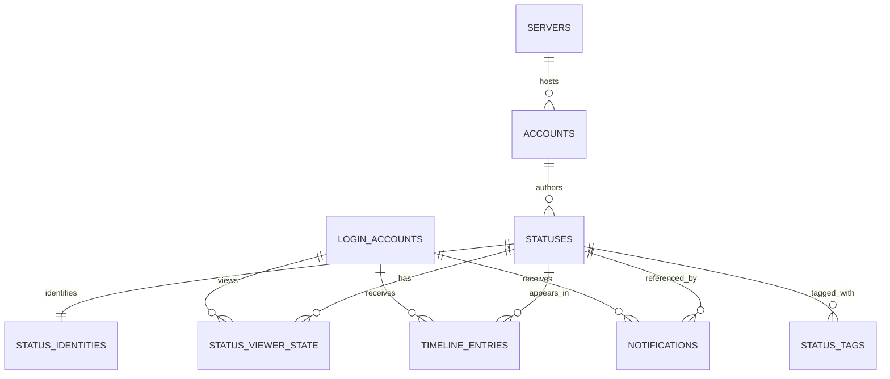

# ADR-0002: Status identity and account-scoped viewer state

- Status: Accepted
- Date: 2026-07-12

## Context

Awayuki can display the same federated object through multiple servers and
multiple signed-in accounts. A server-local status ID is therefore not a
global identity, while `favourited`, `reblogged`, `muted`, and `bookmarked`
describe one viewing login account rather than the canonical post.

## Decision

- A status subject is identified by `protocol`, `server_domain`,
  `canonical_uri`, and the server-local `remote_id`.
- Every mutation independently carries `acting_account_acct`; active-account
  UI state is never used as an implicit routing input.
- `statuses` owns canonical content. `status_identities` records its explicit
  protocol identity, and `status_viewer_state` owns account-dependent flags
  under `(login_account_acct, status_id, server_domain)`.
- Remote ActivityPub mutations resolve `canonical_uri` on the acting account's
  server before using a local ID. Resolutions are only an in-memory, short-lived
  cache and are never a second persistent store.
- Notifications are keyed by the receiving account as
  `(id, server_domain, account_acct)`.
- `timeline_entries`, `notifications`, `status_viewer_state`,
  `status_identities`, and `status_tags` reference their owners with
  `ON DELETE CASCADE`.

## Unified timeline and active actor

- Home reads and merges every signed-in ActivityPub and Bluesky session.
- Public reads and merges every signed-in ActivityPub session. A Bluesky
  capability result cannot disable ActivityPub Public for another account.
- Notification reads and merges every signed-in session.
- Active account selects only the actor for post, boost, favourite, bookmark,
  relationship, edit, and delete operations. It never selects a Home, Public,
  Notification, SQL, Search, or YQ source.
- Account-bound Local, List, Hashtag, profile, and AIR operations carry an
  explicit source account. Ambiguous same-domain routing falls back to the
  SQLite cache, never implicitly to the active actor.

The frontend mirrors this with a canonical entity map and column ordered-key
indexes. Stream events retain their source account for viewer-state updates but
route to every matching Unified column regardless of legacy column owner data.

## Delete and retain policy

| Entity | Owner deletion | Reason |
| --- | --- | --- |
| `servers`, `accounts`, `statuses` | Retained during logout | They are shared cache content and may be referenced by another login account. |
| `status_viewer_state` | Cascade on login account or status | The value has no meaning without both owners. |
| `timeline_entries` | Cascade on login account or status | Membership belongs to one receiving account. |
| `notifications` | Cascade on receiving account, actor, or referenced status | A row must never silently change its receiver or point at an orphan. |
| `status_identities`, `status_tags` | Cascade on status | They describe only that canonical cache row. |

## Portability

All rows above, including login credentials, remain in `awayuki.db`. No
identity mapping, viewer state, upload capability, or account routing state is
persisted in an OS credential store, registry, or side file. Moving the SQLite
file remains sufficient to move the complete persistent application state.
