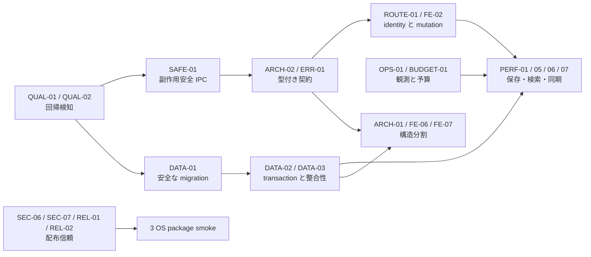

# 07. 実行ロードマップ

## 原則

1. P0 の正しさを直す前に大規模なファイル分割を始めない。
2. 既存挙動を characterization test で固定してから境界を移す。
3. schema、IPC、identity は一度に全面切替せず、読み書き互換を保つ短い段階移行を使う。
4. 性能タスクは OPS-01 / BUDGET-01 の計測と同じ変更で before / after を残す。
5. セキュリティ修正は code だけでなく、鍵・更新・3 OS 実機の運用まで完了条件に含める。未リリースの OS store 方式に対する移行・復旧経路は作らない。

## 依存関係の概略



## Wave 0: ベースラインと緊急封じ込め

目安: 1 週間以内。機能開発と並行できる小さい変更を先行する。

| 順序 | タスク | 成果 |
| --- | --- | --- |
| 0-1 | QUAL-01 の最小版 | 現在成功する build / tsc / test と fmt drift を CI 化。Clippy debt は追跡したうえで短期修正 |
| 0-2 | SAFE-01 | non-idempotent command の一律再試行を停止し、応答喪失テストを追加 |
| 0-3 | DATA-01 の診断部 | schema inspector、既知の部分適用 fixture、transaction rollback、DB file/dir 権限補正 |
| 0-4 | CRED-01 | DB/log permissions、portable mode の明示警告、secret redaction。資格情報を含む単一DB契約を固定 |
| 0-5 | SEC-09 | release build の DevTools と不要な unstable feature を無効化 |
| 0-6 | SEC-06 / SEC-07 / REL-02 の封じ込め | OS側へ状態を持つupdaterを全廃し、linuxdeploy等のdownload digest検証とsigning jobのref制限を先行 |
| 0-7 | FE-01 / FE-05 | 永久 spinner と Bluesky Enter submit 等、復旧不能／誤操作の小さい問題を解消 |

### Exit gate

- mutation の配送エラーで自動二重実行しない。
- migration を失敗させた fixture が DB を破壊せず再起動できる。
- PR で build / type / Rust tests が必ず走る。

## Wave 1: データ・契約・信頼境界の基盤

目安: 2〜4 スプリント。以下は別担当で並行可能だが、生成型と schema の merge 順を管理する。

### Data lane

1. DATA-01 を version/checksum/transaction 付き migrator へ完全移行。
2. DATA-02 で active account、logout、column、status 保存を transaction 化。
3. DATA-03 で orphan cleanup、FK、canonical identity の schema を導入。
4. CONF-01 と AUTH-01 で設定／token 世代の整合性を確立。

### Contract and account lane

1. ERR-01 の安定 error code と request ID。
2. ARCH-02 の generated client を read command から導入し、mutation へ広げる。
3. ROUTE-01 と FE-02 で acting account / canonical status identity / entity update を統一。
4. UI-01 で mutation / confirmation / uncertain state の UI lifecycle を統一。
5. ARCH-03 の capability snapshot を先に小さく導入し、全面 adapter 分割は後続。

### Trust lane

1. SEC-01 HTML sanitizer、SEC-03 OAuth、SEC-04 media boundary、SEC-05 / FE-04 sidecar policy と lifecycle、SEC-10 CSP 縮小。
2. SEC-02 で資格情報を SQLite のみに保存し、DB 移動だけで復元できる契約を3 OSで固定。
3. SEC-06でOS側へ状態を持つupdaterを全廃し、SEC-07 download checksum、REL-02 signing job isolationを固定。
4. REL-01 の artifact manifest / appcast 検証と PKG-01 の clean package smoke。

### Quality lane

1. QUAL-02 の migration、IPC retry、OAuth、sanitizer、account routing test を優先追加。
2. OPS-01 で operation ID、queue/sync/query metrics、redaction を導入。
3. FE-10 で mock を production graph から外し、generated contract test 用の厳密な adapter にする。
4. BUDGET-01 の再現 dataset と主要 benchmark を準備。

### Exit gate

- 全既存 DB fixture が最新版へ原子的に移行する。
- account と status identity が UI / IPC / DB / protocol adapter で一意に追跡できる。
- token は SQLite 以外へ永続化されず、OAuth callback は state / timeout を検証する。
- release artifact と appcast の署名／digest が機械検証される。

## Wave 2: Hot path のスケーリング

目安: 2〜4 スプリント。まず resource 上限、次に query algorithm の順に行う。

| 順序 | タスク | 理由 |
| --- | --- | --- |
| 2-1 | PERF-12 | 全 network path に timeout / cancel / body limit を与え、後続計測が無期限停止しないようにする |
| 2-2 | PERF-03、PERF-04 | unbounded queue と全量 polling を止め、メモリ／write 増幅を封じる |
| 2-3 | PERF-02、PERF-05 | quote を request path から外し、DB を batch commit する |
| 2-4 | PERF-01 | 差分 startup sync と retention でデータ増加の入口と蓄積を同時に制御する |
| 2-5 | PERF-06、PERF-07、SQL-01 | FTS、compiled YQ、custom SQL budget でローカル query を有界化する |
| 2-6 | PERF-09 | entity map と stream micro-batch で UI の O(n²) と無制限配列を解消する |
| 2-7 | PERF-08、PERF-10、PERF-11、PERF-13〜15 | N+1、cache、bundle、frontend scheduler、logging、resource tuning の二次ボトルネックを計測順に処理 |

### Exit gate

- 42 万 status 相当で search / YQ / aggregate の p95 が合意予算内。
- 変更なしの 2 回目起動で全履歴同期せず、ready 時間が履歴総数へ線形比例しない。
- stream burst / 長時間セッションで queue、timeline、cache、log、DB が設定上限を持つ。
- overflow / reconnect / cancel 後に DB と UI が自動再同期する。

## Wave 3: 構造リファクタリング

目安: 複数スプリント。Wave 1/2 の契約・テストを安全網にして段階移行する。

1. ARCH-01: command facade → use case → repository / adapter の順に 1 feature ずつ移す。
2. FE-06: session / entity / pane / compose / settings / overlay slices と pure reducer へ分離。
3. FE-07: Timeline / Settings / Compose を feature controller と view に分離。
4. FE-08 / FE-09: timeline descriptor、capability、semantic DTO、typed i18n を完成。
5. FE-11: accessible UI primitives を共通化。
6. DEAD-01 / DOC-01: 旧 GPUI code/assets/docs と全体 allow を回収。

### Exit gate

- 新 command は薄い IPC handler と独立 unit-testable use case で追加できる。
- 新 timeline type / protocol capability は 1 descriptor / adapter を正本に追加できる。
- store/component 分割後も entity、scroll、mutation、accessibility の回帰テストが通る。
- 現行文書だけで clean checkout から build、test、package、障害診断できる。

## Wave 4: 継続改善

- SEC-08: macOS entitlement の実機監査と定期最小化。
- PERF-10〜15: profiler / budget で効果が確認できる項目だけ継続最適化。
- FE-10: dev mock と fixtures を contract test 基盤として保守。
- DEP-01: toolchain / feature / vulnerability / license の定期更新。
- REL-01: reproducibility、SBOM、provenance、鍵 rotation の定期演習。

## タスク着手時の記録テンプレート

各 issue / PR に以下を記録する。

```md
- Task ID:
- 対象 failure mode:
- Before metric / reproduction:
- Compatibility constraints:
- Migration / rollback:
- Security and privacy impact:
- Tests added:
- After metric:
- Follow-up debt and removal date:
```

## 完了の定義

この監査は「ファイルを分割した」「lint を消した」だけでは完了しない。P0/P1 の failure mode がテストで再現・防止され、SQLite schema変更の原子性とportable DB contractが実証され、固定 dataset の性能値が予算内に入り、3 OS の署名済み／検証可能な package が clean environment で動くことを完了条件とする。未リリースのOS store方式からの移行・復旧経路は対象にしない。
